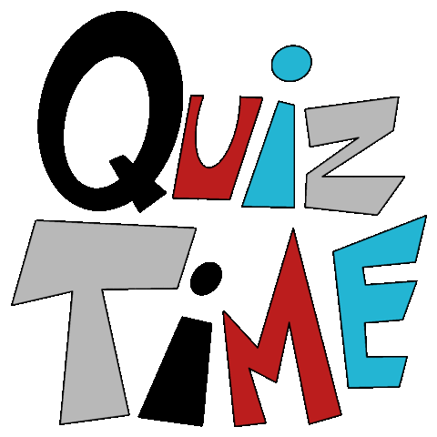

# Hi there 👋

I'm Simon, a young student with a passion for computers and new technologies!
Kind of like the guy in [Cloudy with a chance of Meatballs](https://www.youtube.com/watch?v=dQw4w9WgXcQ), I spend my days imagining and developing systems to make the world a better place!

 

- 🔭 I’m currently working on **[discord-starboards](https://github.com/SimonLeclere/discord-starboards), a complete framework to facilitate the creation of starboards using discord.js**
- 🌱 I’m currently learning **Javascript, and especially Node.JS**
- 🤔 I’m looking for help with **[discord-starboards](https://github.com/SimonLeclere/discord-starboards), [js-string-cleaner](https://github.com/SimonLeclere/Js-String-Cleaner)**
- 📫 How to reach me: **You can contact me [by mail](mailto:simon-leclere@orange.fr) or with discord for a faster response (sιмση ℓεcℓεяε#5765)**
- ⚡ Fun fact: I am a fervent defender of textmojis haha ;) :) :/ -\_- ¯\\\_(ツ)\_/¯, I play guitar and drink only sparkling water ✨

 

 

🎲 This readme is also a real-time multiplayer trivia game! Try to answer the following question by clicking on the answer you think is correct!

  
🛠️ How does it work?

  Each answer is a link to a pre-filled issue. When you press "Submit new issue", it triggers a Github action workflow that compares your answer with the correct answer, finds a new question and updates the readme.md file. Not bad huh?! This whole process only takes about 20 seconds!

## What is the defining characteristic of someone who is described as hirsute?

 

| [Rude](https://github.com/SimonLeclere/SimonLeclere/issues/new?title=quiz%7C1555%7CRude&body=Just%20click%20'Submit%20new%20issue'.) | [Hairy](https://github.com/SimonLeclere/SimonLeclere/issues/new?title=quiz%7C1555%7CHairy&body=Just%20click%20'Submit%20new%20issue'.) | [Funny](https://github.com/SimonLeclere/SimonLeclere/issues/new?title=quiz%7C1555%7CFunny&body=Just%20click%20'Submit%20new%20issue'.) | [Tall](https://github.com/SimonLeclere/SimonLeclere/issues/new?title=quiz%7C1555%7CTall&body=Just%20click%20'Submit%20new%20issue'.) |
| - | - | - | - | 

 

  
📒 Last 10 responses :

- **azgar44** answered **red and yellow** to `What colors are the two circles in the MasterCard logo?` (Good answer)
- **azgar44** answered **Leg** to `What part of the body is damaged if you break your tibia?` (Good answer)
- **azgar44** answered **Caucasus** to `The main objective of the German operation "Case Blue" during World War II was originally to capture what?` (Good answer)
- **azgar44** answered **Spaceman From Pluto** to `What was another suggested name for, the 1985 film, Back to the Future?` (Good answer)
- **azgar44** answered **red** to `What color is a ruby?` (Good answer)
- **azgar44** answered **fashion designer** to `What is Delta Burke's character's job on the sitcom 'Designing Women'?` (Wrong answer)
- **azgar44** answered **Showdown** to `In "Team Fortress 2", what is the fastest taunt kill that can be pulled off?` (Good answer)
- **zechaos031** answered **Gooty** to `Which of the following is another name for the "Poecilotheria Metallica Tarantula"?` (Good answer)
- **zechaos031** answered **Leonardo da Vinci** to `Who painted the Mona Lisa?` (Good answer)
- **zechaos031** answered **5 Minutes, 50 Seconds** to `How long was the World Record Speed Run of Valve Software&#039;s "Half-Life" that was done in 2014.` (Wrong answer)

 

📊 Leaderboard :

| User | Number of wins |
|-|-|
| [Mr-KayJayDee](https://github.com/Mr-KayJayDee) | 8 |
| [SimonLeclere](https://github.com/SimonLeclere) | 8 |
| [MRakox](https://github.com/MRakox) | 6 |
| [azgar44](https://github.com/azgar44) | 6 |
| [zechaos031](https://github.com/zechaos031) | 5 |
| [Androz2091](https://github.com/Androz2091) | 1 |
| [TapsHTS](https://github.com/TapsHTS) | 1 |

[Click here to see your stats](https://github.com/SimonLeclere/SimonLeclere/issues/new?title=MyStats&body=Just%20click%20%27Submit%20new%20issue%27.)